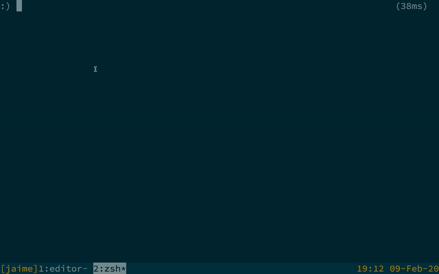

# Jaime

A command line launcher inspired by Alfred.



## Install

Download a release from Github or clone this repository and install locally
with:

```
cargo install --path .
```

## Configuration

Configuration file that I use:
https://github.com/juanibiapina/dotfiles/blob/master/jaime/config.yml

Jaime looks for a config file in the XDG Config directory (usually
~/.config/jaime/config.yml). The configuration specifies which widgets will be
available. For instance, two simple widgets:

```
---
widgets:
  screensaver:
    type: Command
    command: open -a ScreenSaverEngine
  brew:
    type: Select
    options:
      install:
        type: DynamicSelect
        arguments:
          - brew search
        command: brew install {}
        preview: brew info {}
```

### Widgets

Widgets can be of several types:

#### Command

Runs a single command using the shell:

```
widgets:
  screensaver:
    type: Command
    command: open -a ScreenSaverEngine
```

Attributes:

- `command`: The command to run

#### Select

Presents a static list of options. Each option is another widget:

```
widgets:
  cmd:
    type: Select
    options:
      build:
        type: Command
        command: make build
      install:
        type: Command
        command: make install
```

Attributes:

- `options`: A map of widgets names to widgets

#### DynamicSelect

Presents a dynamic list of options. Each entry in the `arguments` list is presented in sequence, then its selection is saved in the register `0`, `1` and so on. An argument can use a placeholder like `{0}` to refer to the result of previous arguments. `command` is the final shell command which will be run.

```
widgets:
  asdf-install:
    type: DynamicSelect
    arguments:
      - asdf plugin-list
      - asdf list-all {0}
    command: asdf install {0} {1}
```

Attributes:

- `arguments`: list of commands to generate arguments
- `command`: final command to execute
- `preview` (optional): command to run to generate a preview window

The `preview` command uses the placeholder syntax from
[skim](https://github.com/lotabout/skim), and does not know which argument
command is currently being viewed. In practice that means it can only work well
when the list of argument commands has only one entry.

#### FreeText

Takes text input from the user and passes it as argument to a command. The text
is not quoted when passed to the command.

```
widgets:
  duck:
    type: FreeText
    command: open "https://duckduckgo.com/?q={}"
```

Attributes:

- `command`: command to execute

## Usage

Run `jaime` to launch a fuzzy search window and select commands.

## Shortcuts

### Zsh

Source `shell/key-bindings.zsh` in order to bind `ctrl+space` to the Jaime widget.

### Tmux

Add this to your tmux.conf to make `<prefix>-Space` open the Jaime launcher in a split window.

```
# Run Jaime
unbind Space
bind Space split-window -v "jaime"
```
